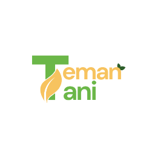

<p align="center">
  
</p>

# 🌾 TemanTani – Smart Agriculture Dashboard

TemanTani adalah aplikasi **web dashboard pertanian pintar** yang mengintegrasikan **IoT, AI, Big Data, dan marketplace** untuk membantu petani dalam mengelola lahan, memantau kondisi tanaman secara real-time, melakukan prediksi hasil panen, serta memasarkan hasil pertanian secara langsung ke pembeli.

Proyek ini bersifat **simulasi frontend** menggunakan React + TypeScript dan **mock data/DOM**, sehingga dapat dijalankan tanpa backend maupun database nyata.  

---

## ✨ Fitur Utama

### 🌿 Dashboard Petani
- 📶 **Data Sensor Real-time** – Kelembapan, suhu, dan riwayat dalam bentuk grafik.
- ☁️ **Prakiraan Cuaca Harian** – Menggunakan **OpenWeather API**.
- 💧 **Kontrol Smart Irrigation** – Mode otomatis dan manual, menampilkan data debit air saat pompa aktif.
- 🔔 **Notifikasi Otomatis** – Misalnya peringatan kelembapan rendah.
- 🌱 **Eco-Score Keberlanjutan** – Skor A–E berdasarkan analisis LCA siklus hidup tanaman.
- 📊 **Prediksi Hasil Panen (AI)** – Input data panen sebelumnya, tampilkan hasil prediksi dan grafik tren.
- 📈 **Tren Harga Pasar** – Simulasi harga komoditas terkini.
- 🛒 **Marketplace Petani (CRUD)** – Upload, kelola, dan jual hasil panen secara langsung.
- 📁 **Laporan Keberlanjutan (PDF)** – Unduh laporan dari hasil eco-score.
- 🧠 **Chatbot Bantuan Petani (AI)** – Berbasis API ChatGPT eksternal.
- 💬 **Fitur Komunitas** – Artikel pertanian, komentar, dan interaksi.
- 📬 **Pesan Pembeli** – Petani menerima dan membalas pesan dari pembeli.

---

## 🧠 Arsitektur Sistem

Proyek ini menggunakan pendekatan berbasis **mock data dan DOM state** tanpa database, dengan struktur 

---

## 🔑 API yang Digunakan

| Layanan | URL | Fungsi |
|--------|------|---------|
| 🌦️ OpenWeather | Prakiraan cuaca harian |
| 🤖 ChatGPT API | Chatbot bantuan petani |
| 📊 Mock API Internal | `mockApiService` | CRUD pengguna, produk, order, forecasting, eco-score |

---

## 🛠️ Teknologi yang Digunakan

- ⚛️ **React + TypeScript** – UI dinamis dan aman tipe.
- 📡 **Mock API & DOM State** – Simulasi data tanpa backend.
- 🌐 **OpenWeather API** – Data cuaca real-time.
- 🧠 **ChatGPT API (Ferdev)** – AI chatbot & rekomendasi panen.
- 📊 **Recharts** – Visualisasi data sensor dan hasil panen.
- 🎨 **Tailwind CSS + ShadCN UI** – Tampilan modern dan responsif.

---

## 📦 Instalasi dan Menjalankan Proyek

```bash
# 1. Clone repository
git clone https://github.com/username/teman-tani.git
cd teman-tani

# 2. Install dependencies
npm install

# 3. Jalankan aplikasi
npm run dev

```


👨‍💻 Pengembang

Dikembangkan oleh Emejleano Rusmin Nggepo, Zahra Ismaya, dan Nurul Santi Hafifah

🌾 TemanTani – Solusi Pertanian Cerdas untuk Masa Depan Berkelanjutan.

<p align="center">
  
</p>